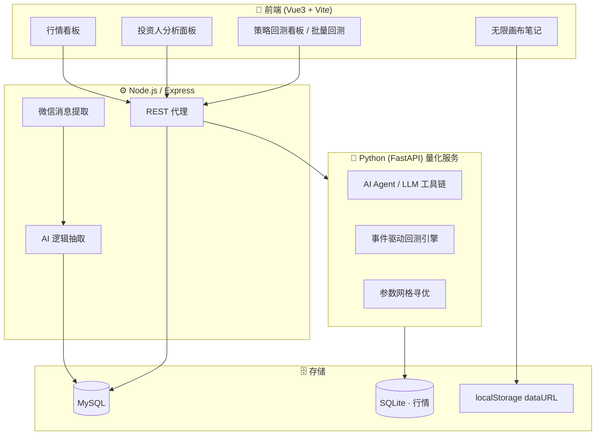
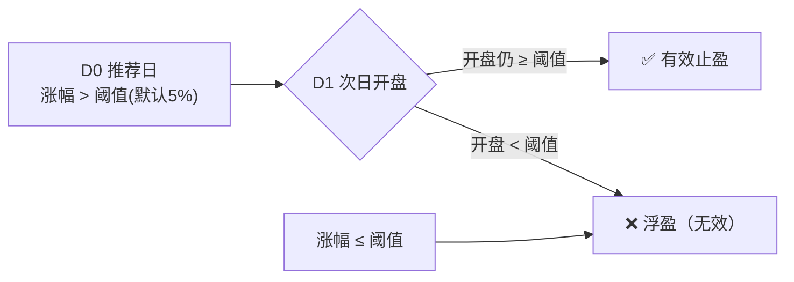

# 📈 Asset Tracker AI · A股投研决策引擎

<p align="center">
  <a href="https://github.com/wangwenlin-coder05/asset-tracker-ai">
    
    
    
    
  </a>
</p>

<p align="center">
  
  
  
  
  
  
  
  
</p>

> 面向个人 A 股投资者的**投研决策引擎**：行情看板 · AI 大盘情绪分析 · 智能推荐自动提取 · **T+1 有效止盈风控模型** · 无限画布复盘，**并内置可自然语言驱动的 AI Agent 量化回测子系统**。

---

## 📐 系统架构



---

## 🧮 核心算法：T+1 有效止盈模型

> 避免「同一日冲高回落」的虚假止盈，只把**真正次日盘中仍能守住涨幅**的推荐算作有效业绩。



阈值可配置（5% / 10% / 20%），支持按推荐源评估「有效止盈胜率」排名投资人表现。

---

## 🤖 量化回测子系统（quant/）

自然语言驱动的完整投研闭环：**「回测茅台，止盈5%，止损5%」→ 自动同步 → 建策略 → 回测 → 生成报告**。

| 模块 | 说明 |
|------|------|
| **AI Agent** | LLM Function Calling 编排 同步→回测→报告 多步工具链；内置确定性规则**双路径回退**，无 Key 也能端到端跑通 |
| **事件驱动回测引擎** | 逐 K 线撮合、T+1 次日开盘成交、显式规避未来函数；numpy 向量化计算最大回撤 / 夏普 |
| **参数网格寻优** | 多标的 × 参数组合笛卡尔积扫描，一键输出最优 止盈/止损/移动止盈/持仓 配置 |
| **T+1 止盈风控** | 识别「冲高回落」虚盈；止盈/止损/移动止盈/持仓天数均支持参数化扫描 |
| **数据链路** | 腾讯/baostock 双源增量同步、自动识别交易所前缀、指数退避重试，落库 SQLite |

> 数据与回测结果仅供研究参考，**不构成投资建议**。仅回测验证，不下单、不接实盘。

---

## 🚀 快速开始

```bash
git clone https://github.com/wangwenlin-coder05/asset-tracker-ai.git

# —— 主应用（Node + MySQL）——
npm install
cp .env.example .env   # 配置数据库等
npm start
cd frontend && npm install && npm run dev   # 默认 http://localhost:5173

# —— 量化服务（Python）——
cd quant
python -m venv .venv
.venv\Scripts\activate         # Windows；Linux/macOS: source .venv/bin/activate
pip install -r requirements.txt
python -m uvicorn quant.api:app --host 127.0.0.1 --port 8000
```

前端「策略回测」板块经 Node 代理 `/api/quant/*` → 8000 端口。详细用法见 [quant/README.md](quant/README.md)。

---

## 📁 目录结构

```
asset-tracker-ai/
├─ server.js               # Node 后端入口（Express + 代理）
├─ wechat-extractor.js     # 微信消息提取 / 分类
├─ wechat_monitor.py       # Python 微信监控服务
├─ frontend/               # Vue3 前端
│   ├─ src/components/     # 行情/面板/画布/回测组件
│   └─ vite.config.js
├─ quant/                  # 量化回测子系统
│   ├─ quant/             # 引擎/策略/Agent/数据同步/API
│   └─ tests/              # 引擎与 API 用例
└─ .env.example            # 环境变量示例
```

---

## 📜 说明

- 本项目用于个人投研与学习实践。
- 行情与推送数据仅供研究参考，**不构成任何投资建议**；量化模块仅做回测验证，不下单、不接实盘。
- 敏感配置（数据库、API 密钥）请放在 `.env` 中，**不要提交到仓库**。