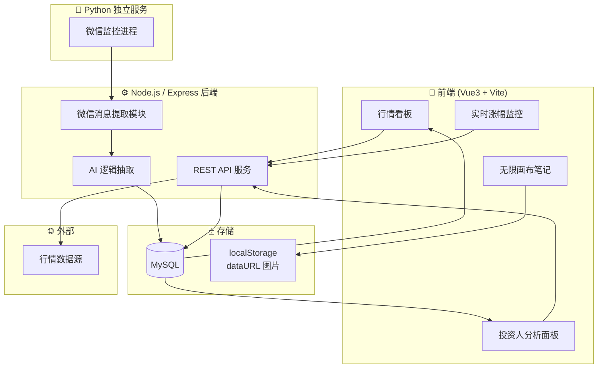

# 📈 Asset Tracker AI · 股票投研辅助系统

<p align="center">
  <a href="https://github.com/wangwenlin333/asset-tracker-ai">
    
  </a>
  <a href="https://github.com/wangwenlin333/asset-tracker-ai">
    
  </a>
  <a href="https://github.com/wangwenlin333/asset-tracker-ai/watchers">
    
  </a>
  <a href="https://github.com/wangwenlin333/asset-tracker-ai/releases">
    
  </a>
  <a href="https://github.com/wangwenlin333/asset-tracker-ai/issues">
    
  </a>
</p>

<p align="center">
  
  
  
  
  
  
</p>

> 面向个人 A 股投资者的**投研决策引擎**：行情看板 · AI 大盘情绪分析 · 智能推荐自动提取 · **T+1 有效止盈风控模型** · 无限画布复盘，让每一次交易决策都有数据与逻辑支撑。

---

## 📐 系统架构



---

## 🧮 核心算法：T+1 有效止盈模型

> 避免「同一日冲高回落」的虚假止盈，只把**真正次日盘中仍能守住涨幅**的推荐算作有效业绩。

```mermaid
flowchart LR
    A["D0 推荐日<br/>涨幅 > 阈值(默认5%)"] --> B{"D1 次日开盘"
    B -->|"开盘仍 ≥ 阈值"| C["✅ 有效止盈"]
    B -->|"开盘 < 阈值"| D["❌ 浮盈（无效）"]
    A2["涨幅 ≤ 阈值"] --> D
```

阈值可配置（5% / 10% / 20%），支持按推荐源评估「有效止盈胜率」排名投资人表现。

---

## ✨ 功能全景

### 行情与分析
- **实时行情看板**：涨幅统计、昨日涨停表现、大小盘指数等核心指标可视化。
- **投资人分析面板**：按「有效止盈胜率」评估推荐质量，区分**有效止盈 / 锁定**状态。

### AI 辅助
- **AI 推荐自动提取**：监控微信推送消息 → 自动分类、去重、入库，用 AI 抽取推荐逻辑并绑定股票。
- **AI 投资人画像**：跟踪各推荐源收益表现，生成可视化分析。
- **微信监控服务**（独立 Python 进程）：监听推送，对接后端 API。

### 无限画布笔记
- 基于 Vue Flow 的**无限画布**：节点连线、便签、图片上传（本地 dataURL）、触摸交互、撤销重做。
- 平板友好：双指缩放、双击编辑文字、底部固定编辑栏（字号 / 加粗 / 斜体 / 颜色）。
- 数据自动持久化。

---

## 🚀 快速开始

```bash
# 后端
git clone https://github.com/wangwenlin333/asset-tracker-ai.git
npm install
cp .env.example .env   # 配置数据库等
npm start

# 前端
cd frontend && npm install && npm run dev
# 开发默认 http://localhost:5173
```

---

## 📁 目录结构

```
asset-tracker-ai/
├─ server.js               # Node 后端入口（Express + MySQL）
├─ wechat-extractor.js     # 微信消息提取 / 分类
├─ wechat_monitor.py       # Python 微信监控服务
├─ frontend/               # Vue3 前端
│   ├─ src/components/    # 行情/面板/画布组件
│   └─ vite.config.js
└─ .env.example           # 环境变量示例
```

---

## 📜 说明

- 本项目用于个人投研与学习实践。
- 行情与推送数据仅供研究参考，**不构成任何投资建议**。
- 敏感配置（数据库、API 密钥）请放在 `.env` 中，**不要提交到仓库**。